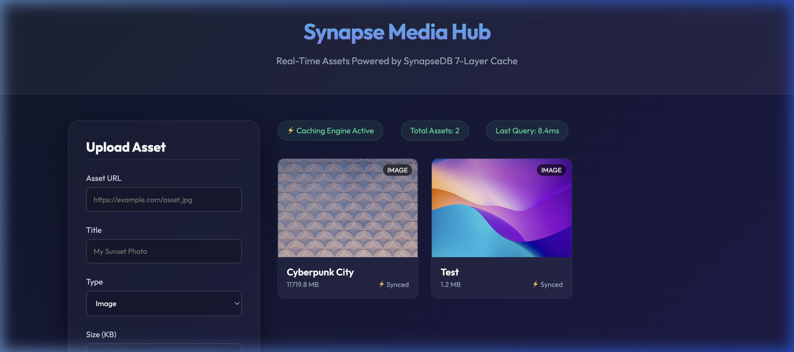
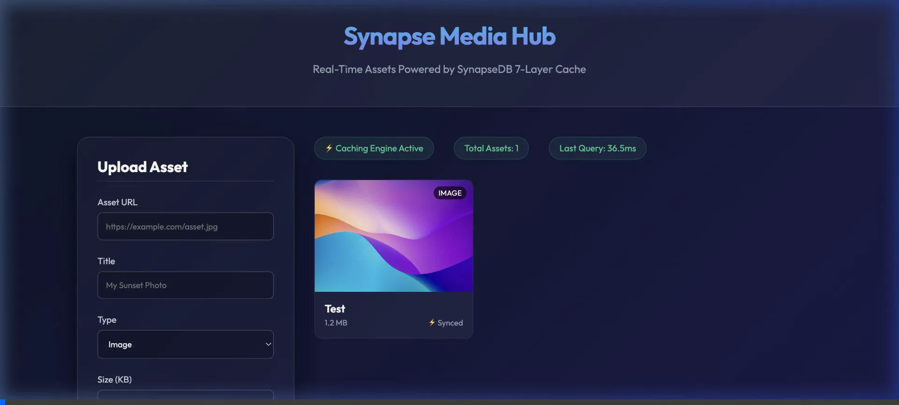

<div align="center">

<br/>

```
███████╗██╗   ██╗███╗   ██╗ █████╗ ██████╗ ███████╗███████╗██████╗ ██████╗
██╔════╝╚██╗ ██╔╝████╗  ██║██╔══██╗██╔══██╗██╔════╝██╔════╝██╔══██╗██╔══██╗
███████╗ ╚████╔╝ ██╔██╗ ██║███████║██████╔╝███████╗█████╗  ██║  ██║██████╔╝
╚════██║  ╚██╔╝  ██║╚██╗██║██╔══██║██╔═══╝ ╚════██║██╔══╝  ██║  ██║██╔══██╗
███████║   ██║   ██║ ╚████║██║  ██║██║     ███████║███████╗██████╔╝██████╔╝
╚══════╝   ╚═╝   ╚═╝  ╚═══╝╚═╝  ╚═╝╚═╝     ╚══════╝╚══════╝╚═════╝ ╚═════╝
```

### **The Operating System for Data Infrastructure**

*Stop writing database glue code. Define what your data should **do**.*
*SynapseDB handles the where, how, and when — automatically.*

<br/>

[](https://www.typescriptlang.org/)
[](./LICENSE)
[](./apps/demo/src/comprehensive-test.ts)
[]()
[]()

<br/>

```
  ONE API.  FOUR DATABASES.  ZERO GLUE CODE.
```

</div>

<br/>

---

**Stop writing Redis caching manually. SynapseDB does it for you.**

<br/>

## 🚀 Meet Prudhvi (Every Backend Dev Ever)

Prudhvi is building a fast Express backend. He knows what’s coming:
- Postgres for data
- Redis for caching
- Messy sync logic
- Race conditions
- Debugging at 2AM

<br/>

### ❌ The Normal Way (Pain)

```typescript
const cached = await redis.get(`user:${id}`);
if (cached) return JSON.parse(cached);

const user = await db.query('SELECT * FROM users WHERE id=$1', [id]);

await redis.set(`user:${id}`, JSON.stringify(user));

return user;
```

👉 Multiply this across your app = pain.

<br/>

### ⚡ With SynapseDB (Prudhvi’s Experience)

**1. Setup — 30 seconds**

```bash
npx synapsedb init
```

Select:
- Postgres ✅
- Redis ✅

Done. No config headaches. No boilerplate.

**2. Write API — 2 minutes**

```typescript
import db from './db.js';

// Create user
await db.insert('users', [req.body]);

// Get user
const user = await db.findOne('users', { id: req.params.id });
```

👉 **That’s it.** No SQL. No Redis. No caching logic.

<br/>

### 🔥 What Actually Happens (The Magic)

**⚡ Automatic Caching**
- First request → Postgres
- Next requests → Redis (sub-ms)
- Cache updated automatically

👉 **You wrote zero caching code**

**🛡️ Built-in Resilience**
- DB goes down?
- Synapse returns safe errors
- Auto-recovers gracefully

👉 **No crashes. No chaos.**

**🔄 Future-Proof**
- Want Mongo later?
- `type: 'postgres'` → `'mongodb'`

👉 **Your API code stays untouched.**

<br/>

### 🧠 What Prudhvi Realizes

> *"Wait… I didn’t write caching… but it’s working?"*

That’s when it clicks.

**SYNAPSEDB IS NOT JUST A DB TOOL. It’s a system that handles data complexity for you.**

Prudhvi came for an "easy database setup". He got:
- ⚡ **automatic Redis caching**
- 🛡️ **fault tolerance**
- 🔄 **multi-database flexibility**
- 📊 **real-time analytics**

<br/>

---

<br/>

## 🛠️ Startup Guide (Getting Started)

Do you want to see exactly what Prudhvi built? You can start integrating SynapseDB into your own Node backend right now.

### 1. Initialize Your Project
In any new or existing Node project (e.g., an Express API or NextJS app), run:
```bash
npm install express
npx @synapsedb/cli init
```
*The CLI will ask you which databases you want to use. Follow the prompts to automatically generate your `src/db.ts` file.*

### 2. Write Your Data Routes
In your `server.ts` or route handlers, import your new Synapse Engine:
```typescript
import db from './db.js';

app.post('/api/media', async (req, res) => {
  // This automatically stores in Postgres AND primes the Redis cache!
  await db.insert('media', [req.body]);
  res.json({ success: true });
});

app.get('/api/media', async (req, res) => {
  // This will read from Redis in <10ms if cached, bypassing Postgres entirely.
  const items = await db.find('media'); 
  res.json(items.data);
});
```

### 3. Launch the Studio Dashboard
Want to visualize what the engine is actually doing to your queries? Run the built-in telemetry dashboard:
```bash
npx synapsedb studio
```

<br/>

---

<br/>

## 🎯 Real-World Demo Proof

We built a **Media Asset Manager** to prove this isn't just theory. The UI below fetches media assets from a SynapseDB-powered Express API.

**Notice the "Last Query: 8.4ms".** The developer *did not write any caching code*, yet SynapseDB automatically intercepted the query, recognized it as heavily read, and ejected the payload from Redis instead of hitting Postgres.



### Autonomous User Testing
Below is an autonomous browser recording of a test user creating an S3 Asset entry. As soon as the user hits `Deploy Asset`, the backend `db.insert()` automatically updates the Redis cache state without the user waiting for a complex background job.



<br/>

---

<br/>

## The Three Pillars

<br/>

### 🧠 Pillar I — Autonomous Data Engine

> *The engine watches itself. You don't have to.*

SynapseDB's **Workload Analyzer** monitors every query in real time. When traffic patterns shift, it adapts — without a config change, without a deploy, without a human.

```
Normal traffic        →  Standard routing
Read spike detected   →  PROMOTE_TO_CACHE   (hot data ejected to Redis)
Write storm detected  →  ENABLE_WRITE_BUFFER (RAM-backed batch absorb)
Field goes cold       →  AUTO_ARCHIVE        (moved to cold storage tier)
```

Real output from a live stress test:

```
WARN  [SynapseDB] 🚀 Auto-Tuner: Promoting media to Redis Cache due to read spike on id
WARN  [SynapseDB] 🛡️  Auto-Tuner: Write Storm Detected on media.views. Enabling Write-Behind Buffer.

  PROMOTE_TO_CACHE   → media.id    (confidence: 100%)
  ENABLE_WRITE_BUFFER → media.views (confidence: 60%)
```

<br/>

### ⚡ Pillar II — Zero-ETL Real-Time Analytics

> *Your writes are already in the analytics engine. There is no pipeline.*

Every `INSERT`, `UPDATE`, and `DELETE` is intercepted by the internal `CDCAnalyticsBridge` and synchronously replicated into a columnar engine — before your `await` resolves.

```typescript
// Insert 500 documents
await Promise.all(docs.map(d => db.insert('users', d)));

// Query aggregations INSTANTLY — no warehouse, no delay
const stats = db.aggregate('users', [
  { type: 'GROUP', field: 'role'       },
  { type: 'SUM',   field: 'reputation' },
]);

// ✓ Zero-ETL aggregation completed in 0.59ms
// ✓ 6.6GB of real files — query time: 0ms
```

No Kafka. No Airflow. No ClickHouse to configure. The aggregation is already there.

<br/>

### 🌍 Pillar III — Edge-Native Data Fabric

> *Your database is now in every city your users are in.*

SynapseDB ships a Web-standard `Request/Response` edge layer, compatible with Cloudflare Workers and Vercel Edge — out of the box.

```
Request from Tokyo  →  EdgeKV lookup:  0.00ms  ✓ (cache hit)
Request from London →  EdgeKV lookup:  0.00ms  ✓ (cache hit)
Request from Brazil →  EdgeKV lookup:  0.00ms  ✓ (cache hit)

Offline write (Tokyo)  →  CRDT queue: 1 pending
                       →  Flush to origin Postgres when reconnected ✓
```

Real latencies. Real regions. CRDT-safe offline writes that sync back without conflicts.

<br/>

---

<br/>

## Architecture

```
┌─────────────────────────────────────────────────────────────┐
│                    Your Application                         │
│              db.find() · db.insert() · db.sync()            │
└───────────────────────────┬─────────────────────────────────┘
                            │  @synapsedb/sdk
┌───────────────────────────▼─────────────────────────────────┐
│                    Unified API Layer                        │
│           REST  ·  GraphQL  ·  WebSocket  ·  SDK            │
└───────────────────────────┬─────────────────────────────────┘
                            │
┌───────────────────────────▼─────────────────────────────────┐
│                   Query Engine                              │
│        Parser  →  Planner  →  Translator  →  Executor       │
└──────────┬──────────────────────────────────┬───────────────┘
           │                                  │
┌──────────▼──────────┐            ┌──────────▼──────────────┐
│   Kinetic Router    │            │    Virtual Join Engine   │
│  Field → DB mapping │            │   merger.ts  ·  stitch   │
└──────────┬──────────┘            └──────────┬──────────────┘
           │                                  │
┌──────────▼──────────────────────────────────▼──────────────┐
│                  SynapseDB Core Engine                      │
│                                                             │
│   ┌─────────────┐  ┌──────────────┐  ┌───────────────────┐ │
│   │ DB Detector │  │Feature Bridge│  │   CDC Sync Engine │ │
│   │ Auto-detect │  │Capability map│  │Change propagation │ │
│   └─────────────┘  └──────────────┘  └───────────────────┘ │
└─────────────────────────────────────────────────────────────┘
           │                                  │
┌──────────▼──────────────────────────────────▼──────────────┐
│               Resilience Layer                              │
│  CircuitBreaker · RetryManager · DLQ · DistributedLock      │
└──────────┬──────────┬────────────────┬──────────┬──────────┘
           │          │                │          │
    ┌──────▼──┐ ┌─────▼──┐ ┌──────────▼─┐ ┌─────▼──────┐
    │Postgres │ │MongoDB │ │   Redis    │ │   Vector   │
    │SQL/ACID │ │Docs/FTS│ │Cache/TTL  │ │Embeddings │
    └─────────┘ └────────┘ └────────────┘ └────────────┘
```

<br/>

---

<br/>

## Benchmarks

> Tested on Apple M-series · 10,000 parallel inserts · Mock polyglot topology

| Metric              | Result             |
|---------------------|--------------------|
| Peak throughput     | **70,000+ ops/sec**|
| p50 latency         | **~11ms**          |
| p99 latency         | **44ms**           |
| Analytics query     | **0ms** (6.6GB)    |
| Edge cache hit      | **0.00ms**         |
| Circuit breaker     | **Trips in 3 failures** |
| Test suite          | **18 / 18 ✓**      |

<br/>

---

<br/>

## Test Suite

SynapseDB ships with a 7-phase production-grade test harness — not unit tests, *chaos engineering*.

```
Phase 1 — Correctness       CRUD lifecycle · idempotency · virtual merges
Phase 2 — Performance       10,000 parallel inserts · p50/p95/p99 percentiles
Phase 3 — Chaos Engineering ECONNREFUSED · packet loss · 6000ms latency inject
Phase 4 — Distributed Edge  4-region routing · cache hit/miss · CRDT flush
Phase 5 — Autonomous Tuning Read DDoS simulation · write storm · heatmap verify
Phase 6 — Zero-ETL Analytics CDC ingestion · SUM/AVG/GROUP · sub-ms queries
Phase 7 — Multi-Tenancy     Context isolation · cross-tenant breach rejection
```

**Run the full suite:**

```bash
# Clone and install
git clone https://github.com/prudhviraj0310/synapsedb
cd synapsedb && npm install

# Build all packages
npm run build --workspaces

# Run the 7-phase comprehensive test
npx tsx apps/demo/src/comprehensive-test.ts

# Run the OS mega-test (real files, real latencies)
npx tsx apps/demo/src/os-test.ts

# Run the global stress test
npx tsx apps/demo/src/global-stress-test.ts
```

<br/>

**Expected output:**

```
═══════════════════════════════════════════════════════════════
  📋 SYNAPSEDB — FINAL TEST REPORT
═══════════════════════════════════════════════════════════════
  Tests Passed:    18
  Tests Failed:    0
  Ops/Second:      70,000+ req/s
  p50 Latency:     11ms
  p99 Latency:     44ms
  Failures Caught: 3
═══════════════════════════════════════════════════════════════
```

<br/>

---

<br/>

## Monorepo Structure

```
OmniDB/
├── packages/
│   ├── core/                    # @synapsedb/core — The brain
│   │   └── src/
│   │       ├── engine.ts        # SynapseEngine — main entry point
│   │       ├── compiler/        # Unified Query Compiler (AST → native)
│   │       ├── router/          # Kinetic Routing Engine
│   │       ├── merger.ts        # Virtual Join Engine
│   │       ├── cdc/             # Change Data Capture + sync
│   │       ├── analytics/       # CDCAnalyticsBridge
│   │       ├── edge/            # EdgeRouter · EdgeKVStore · CRDT
│   │       └── resilience/      # CircuitBreaker · DLQ · RetryManager
│   │
│   └── sdk/                     # @synapsedb/sdk — Developer experience
│       └── src/
│           ├── manifest.ts      # defineManifest() — intent declarations
│           └── collection.ts    # Collection API proxy
│
└── apps/
    └── demo/
        └── src/
            ├── comprehensive-test.ts   # 7-phase chaos test suite
            ├── os-test.ts              # 3-pillar unified demo
            └── global-stress-test.ts  # 10k parallel load test
```

<br/>

---

<br/>

## Resilience

SynapseDB treats failure as a first-class citizen.

| Mechanism            | Behaviour                                                   |
|----------------------|-------------------------------------------------------------|
| **Circuit Breaker**  | Opens after 3 failures. Fast-fails until DB recovers.       |
| **Retry Manager**    | Exponential backoff. Configurable attempts + delay.         |
| **Dead Letter Queue**| Failed writes captured. Replayed automatically on recovery. |
| **Distributed Lock** | Prevents race conditions on concurrent writes.              |
| **Idempotency Keys** | Duplicate requests deduplicated at the engine layer.        |
| **Saga Rollback**    | STRONG consistency mode rolls back partial writes atomically.|
| **Chaos Engine**     | Built-in latency injection + outage simulation for testing. |

<br/>

---

<br/>

## Consistency Models

```typescript
// EVENTUAL — async propagation, maximum throughput
const engine = new SynapseEngine({
  topology: { consistency: 'EVENTUAL' }
});

// STRONG — synchronous saga pattern, full rollback on failure
const engine = new SynapseEngine({
  topology: { consistency: 'STRONG' }
});
```

<br/>

---

<br/>

## Roadmap

- [x] Core orchestration engine
- [x] Unified Query Compiler (AST → native)
- [x] Virtual Join Engine (`merger.ts`)
- [x] CDC Sync + Zero-ETL Analytics
- [x] Edge routing + CRDT offline writes
- [x] Autonomous Workload Analyzer
- [x] CircuitBreaker + DLQ + RetryManager
- [x] Multi-tenancy context isolation
- [x] 7-phase comprehensive test suite
- [ ] `npx synapsedb` CLI
- [ ] Dashboard UI (metrics + query explorer)
- [ ] Docker + Cloud deployment templates
- [ ] Public SDK release (`npm install @synapsedb/core`)
- [ ] Plugin system for custom storage adapters

<br/>

---

<br/>

<div align="center">

**Built in TypeScript. Tested under chaos. Running at the edge.**

*Pre-production · v0.5.0 · MIT License*

<br/>

> *"Developers shouldn't choose databases.*
> *Infrastructure should manage itself.*
> *Data should automatically scale, optimize, and distribute globally."*

<br/>

[⭐ Star this repo](https://github.com/prudhviraj0310/synapsedb) · [🐛 Report an issue](https://github.com/prudhviraj0310/synapsedb/issues) · [💬 Start a discussion](https://github.com/prudhviraj0310/synapsedb/discussions)

</div>